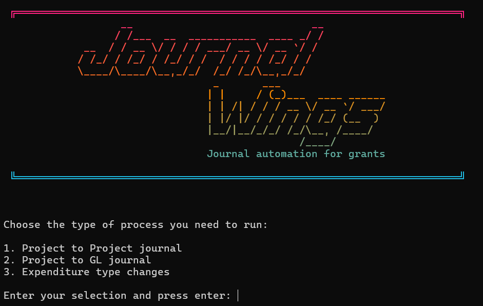
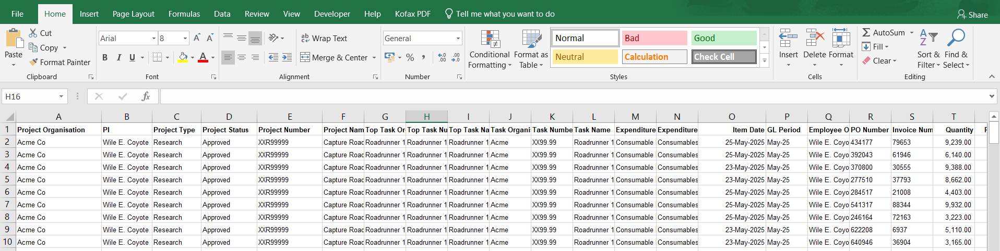
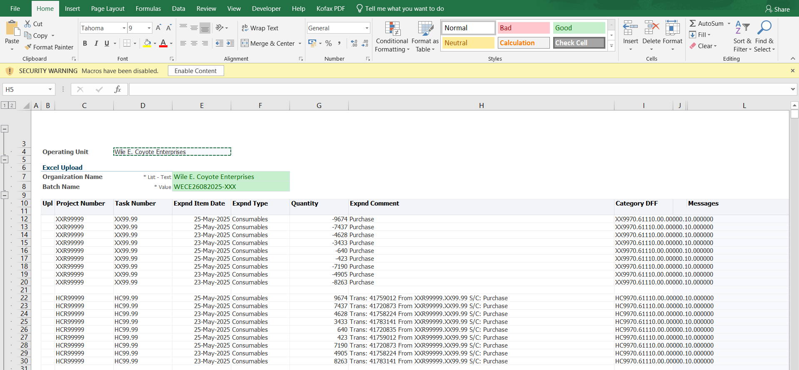

### Journal Wings

## 1. Overview

At first glance, **JournalWings** might look like a copy-paste automation. In reality, it encodes tens of hidden rules that staff previously had to apply manually — formatting quirks, disallowed codes, debit/credit splits, uploader references, and strict file naming conventions. Each of these steps was a potential failure point in the manual process. By turning that into a single guided workflow, JournalWings drastically cuts prep time from ~20 minutes to under 2 for a typical journal, and saves even more time on larger journals, while eliminating most of the error risk. It also ensures that ERP comments are properly attached to each transaction line, supporting a stronger audit trail.

## 2. Problem

How to get from a data dump like this:

To the structured data required for a clean journal move on the ERP system whilst accounting for all our internal rules:

Prior to JournalWings, journal preparation was a fully manual and error-prone task. Transaction data had to be manually restructured to fit the format required by Oracle’s WebADI upload sheet. This involved a time-consuming process of:

* Manually copying and pasting into the correct cells
* Looking up context-specific values (like natural accounts or unit codes)
* Double-checking accuracy before upload

Even a small journal (5–10 lines) could take 15–20 minutes and required re-familiarisation with the details of the process. For larger journals — 100+ lines — the task could balloon into several hours, increasing the risk of mistakes and user frustration. Colleagues consistently described journal creation as a dreaded task, with many recounting stories of errors that took hours to correct.

## 3. Solution

JournalWings removes most of the friction. The user simply collects the data they want to move, selects the type of journal they need, and JournalWings handles the rest — outputting a completed WebADI uploader in seconds.

The app is portable and easy to use. It works from any folder that contains:

1. A `.xlsx` file containing the source data
2. A `.xlsm` file containing a WebADI journal template
3. The JournalWings `.exe` file

Once these are present, JournalWings can be run directly.

JournalWings is tightly scoped. It follows our internal guidance for journal formatting and process rules. It is CLI-only (command line) because the required input is minimal, and there is no need for configuration options. The simplicity is part of its strength.

## 4. Technical Stack

* Python
* openpyxl
* xlwings
* pyinstaller
* Custom exception handling
* Object-oriented design: `AppContext`, `DataManager`, `FileManager`, and others

## 5. Key Features

* Validates presence and readiness of required files
* Handles two input formats (Oracle raw dump and Splash BI reports)
* Limits maximum row count for safety
* Renames each output journal file uniquely
* Internal logic handles formatting, value flipping, column mapping, and comment injection
* Flags lines that shouldn't be moved (e.g. overhead costs, FAC/FEC labels)
* Provides clear user feedback and summary reports

## 6. Challenges and How I Solved Them

### Refactoring a messy process into a clean codebase

* **V1** was a monolithic script: 1000+ lines, almost everything on `self`, multiple open/close file operations, poor modularity.
* **V2** was a complete rebuild using proper OOP design. I created a `Context` object to hold shared state, and broke functionality into coherent modules (FileManager, DataManager, etc.).
* Introduced a dispatch + pipeline pattern to clarify the control flow and make the app easier to extend.

### Understanding WebADI and process nuances

* Different journal types (e.g. project-to-project vs. project-to-GL) require subtle but important differences in coding string and credit/debit structure.
* JournalWings encodes this business logic, relieving the user of having to remember it.

### Handling Excel quirks

* `.xlsm` files with macros must not be opened or saved by `openpyxl`, or macros may be lost.
* I used `openpyxl` to read `.xlsx` files and `xlwings` to handle `.xlsm` macro-enabled templates safely.

### Improving performance

* V1 interacted with Excel far too much.
* V2 reads data once at the start and operates entirely in memory (lists, dicts, comprehensions), making processing fast even on large journals (tested with 15,000 lines).

### Designing a minimal UI

* Explored GUI options (Tkinter, Electron) but they added no value for this use case.
* Settled on a CLI with minimal prompts and file auto-detection based on working folder. It’s fast, retro, and users love it.

### Choosing the right stack

* Python was ideal for its libraries (especially for Excel handling), readability, and ease of packaging.
* PyInstaller made it trivial to distribute an `.exe` to colleagues without needing Python installed.

## 7. Impact

When I joined the department, the journal process felt overwhelming: fiddly, high stakes, and inconsistent. Errors could cause audit issues months later.

Since deploying JournalWings:

* Colleagues are producing accurate journals in seconds, not hours.
* One user saved several hours on a 300+ line journal.
* Even total newcomers can now prepare valid journals unaided.
* Early feedback has been extremely positive

Beyond my team, I believe other departments could save 90–95% of the time per journal. The improvement in accuracy and audit trail will also reduce the risk of disallowed costs downstream.

### 8. What I Learned

* How to break a problem down into manageable chunks

  * Smaller functions with single responsibilities are far easier to debug and reason about.
  * Longer methods are okay *if* internally clean and broken into simple, clear steps.
* How to mentally model data "shape" and restructure it efficiently
* That good tooling can turn you into a magician in the eyes of your colleagues
* That debugging is as much about mindset and patience as it is about code

---

This project pushed my understanding of Python, OOP, file handling, and software design. More importantly, it showed me how satisfying it is to build tools that solve real problems in my organisation.

### 8. What I'm working on next

* **The problem**  
    * Inconsistency across folder hierarchies and file naming conventions  
    * Manual filing slows teams down and leads to misplaced or misnamed documents  

* **The solution**  
    * Build a lightweight **filing assistant / file renamer** that helps users store files correctly without needing to memorise naming rules or folder structures  

* **The idea**  
    * Using **Python and Flask**, create a GUI app with visual **"dropzones"** — tiles representing known destination folders
    * Each dropzone will do one of the following when a file is dropped onto it:  
        * Automatically **rename the file** before saving it, using logic like reading metadata from Excel files (e.g. with `openpyxl`)  
        * Or, **prompt the user with a suggested filename format** to ensure consistency — especially useful when context can't easily be detected (e.g. deciding whether a PDF is a contract, amendment, invoice, etc.)

* **Summary**  
    * Filing consistency is a long-term timesaver, but not every document can be auto-categorised  
    * This app will **automate what it can**, and **prompt intelligently when it can’t**, giving users confidence that every file ends up named and stored correctly  
